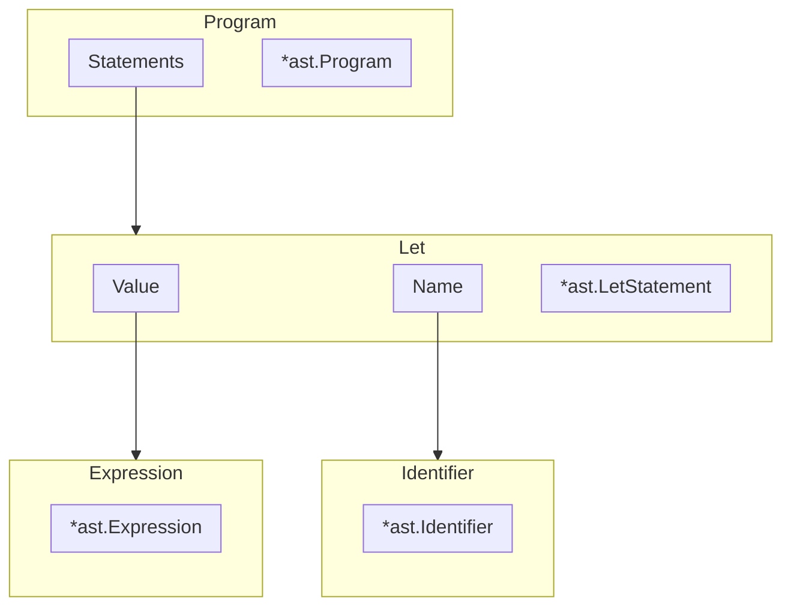

# go-interpreter
Golang으로 만드는 interpreter

## 구조

```mermaid
flowchart TB
    subgraph Program
        direction TB
        subgraph *ast.Program
        end
        subgraph Statements
        end
    end
    subgraph Let
        direction TB
        subgraph *ast.LetStatement
        end
        subgraph Name
        end
        subgraph Value
        end
    end
    subgraph Identifier
        direction TB
        subgraph *ast.Identifier
        end
    end
    subgraph Expression
        direction TB
        subgraph *ast.Expression
        end
    end

    Statements ---> Let
    Name ---> Identifier
    Value ---> Expression
```
